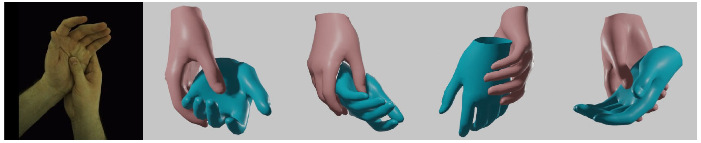

<div align="center">

<h1>Decoupled Iterative Refinement Framework for Interacting Hands Reconstruction from a Single RGB Image</h1>

<div>
    <a href='https://scholar.google.com/citations?user=TzpecsAAAAAJ' target='_blank'>Pengfei Ren<sup>1,2</sup></a>&emsp;
    <a href='https://scholar.google.com/citations?user=v8TFZI4AAAAJ' target='_blank'>Chao Wen<sup>2</sup></a>&emsp;
    <a href='https://scholar.google.com/citations?user=3hSD41oAAAAJ' target='_blank'>Xiaozheng Zheng<sup>1,2</sup></a>&emsp;
    <a href='https://scholar.google.com/citations?&user=ECKq3aUAAAAJ' target='_blank'>Zhou Xue<sup>2</sup></a>
    </br>
    <a href='https://scholar.google.com/citations?user=dwhbTsEAAAAJ' target='_blank'>Haifeng Sun<sup>1</sup></a>&emsp;
    <a href='https://scholar.google.com/citations?user=2W2h0SwAAAAJ' target='_blank'>Qi Qi<sup>1</sup></a>&emsp;
    <a href='https://scholar.google.com/citations?user=H441DjwAAAAJ' target='_blank'>Jingyu Wang<sup>1</sup></a>&emsp;
    <a href="https://dblp.org/pid/60/4951.html">Jianxin Liao<sup>1*</sup></a>
</div>
<div>
    <sup>1</sup>Beijing University of Posts and Telecommunications &emsp; <sup>2</sup>PICO IDL ByteDance &emsp;
</div>
<div>
    <sup>*</sup>Corresponding author
</div>
<div>
    :star_struck: <strong>Accepted to ICCV 2023 as Oral</strong>
</div>

---



<strong> Our method DIR can achieve an accurate and robust reconstruction of interacting hands.</strong>

:open_book: For more visual results, go checkout our <a href="https://pengfeiren96.github.io/DIR/" target="_blank">project page</a>

---

<h4 align="center">
  <a href="https://pengfeiren96.github.io/DIR/" target='_blank'>[Project Page]</a> •
  <a href="https://arxiv.org/abs/2302.02410" target='_blank'>[arXiv]</a>
</h4>

</div>

## :mega: Updates

[10/2023] Released the pre-trained models 👏!

[07/2023] DIR is accepted to ICCV 2023 (Oral) :partying_face:!

## :love_you_gesture: Citation

If you find our work useful for your research, please consider citing the paper:

```
@inproceedings{ren2023decoupled,
    title={Decoupled Iterative Refinement Framework for Interacting Hands Reconstruction from a Single RGB Image},
    author={Ren, Pengfei and Wen, Chao and Zheng, Xiaozheng and Xue, Zhou and Sun, Haifeng and Qi, Qi and Wang, Jingyu and Liao, Jianxin},
    booktitle={Proceedings of the IEEE/CVF International Conference on Computer Vision (ICCV)},
    year={2023}
}
```

## :desktop_computer: Data Preparation

1. Download necessary assets [misc.tar.gz](https://github.com/Dw1010/IntagHand/releases/download/v0.0/misc.tar.gz) and unzip it.
2. Download InterHand2.6M dataset and unzip it.
3. Process the dataset by the code provided by [IntagHand](https://github.com/Dw1010/IntagHand)

```bash
python dataset/interhand.py --data_path PATH_OF_INTERHAND2.6M --save_path ./data/interhand2.6m/
```

## :desktop_computer: Installation

### Requirements

- Python >= 3.8
- PyTorch >= 1.10
- pytorch3d >= 0.7.0
- scikit-image==0.17.1
- timm==0.6.11
- trimesh==3.9.29
- openmesh==1.1.3
- pymeshlab==2021.7
- chumpy
- einops
- imgaug
- manopth

### Setup with Conda

```bash
# create conda env
conda create -n dir python=3.8
# install torch
pip install torch==1.11.0+cu113 torchvision==0.12.0+cu113 --extra-index-url https://download.pytorch.org/whl/cu113
# install pytorch3d
pip install fvcore iopath
pip install --no-index --no-cache-dir pytorch3d -f https://dl.fbaipublicfiles.com/pytorch3d/packaging/wheels/py38_cu113_pyt1110/download.html
# install other requirements
cd DIR
pip install -r ./requirements.txt
# install manopth
cd manopth
pip install -e .
```

## :train: Training

```bash
python train.py  
```

## :running_woman: Evaluation
Download the pre-trained models [Google Drive](https://drive.google.com/file/d/1qoLuw1S-_4e7vYFywVb9NboIHVYJN46H/view?usp=sharing)
```bash
python apps/eval_interhand.py --data_path ./interhand2.6m/  --model ./checkpoint/xxx
```

You can use different joint id for alignment by setting root_joint (0: Wrist 9:MCP)

Set Wrist=0, you would get following output:
```bash
joint mean error:
    left: 10.74602734297514 mm, right: 9.60523635149002 mm
    all: 10.17563184723258 mm
vert mean error:
    left: 10.49137581139803 mm, right: 9.40467044711113 mm
    all: 9.94802312925458 mm
pixel joint mean error:
    left: 6.332123279571533 mm, right: 5.808280944824219 mm
    all: 6.070201873779297 mm
pixel vert mean error:
    left: 6.235969543457031 mm, right: 5.725381851196289 mm
    all: 5.98067569732666 mm
root error: 28.983158990740776 mm
```
(We fixed some minor bugs and the performance is higher than the value reported in the paper)

## :newspaper_roll: License

Distributed under the MIT License. See `LICENSE` for more information.

## :raised_hands: Acknowledgements

The pytorch implementation of MANO is based on [manopth](https://github.com/hassony2/manopth). We use some parts of the great code from [IntagHand](https://github.com/Dw1010/IntagHand). We thank the authors for their great job!
